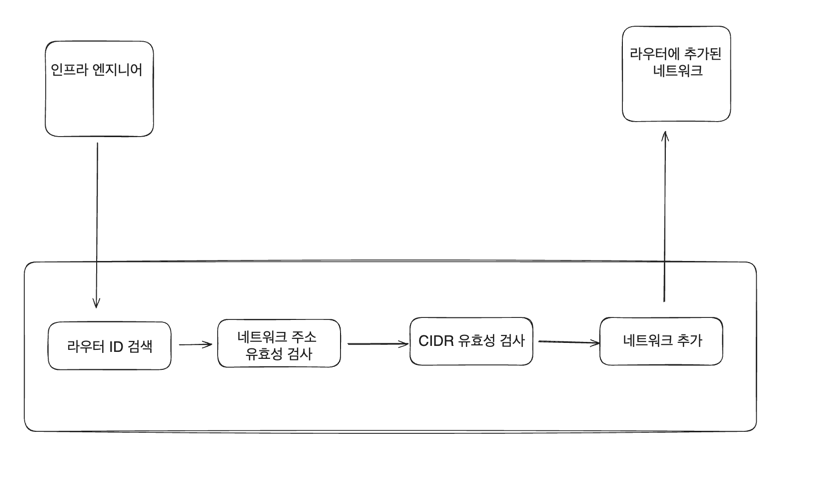
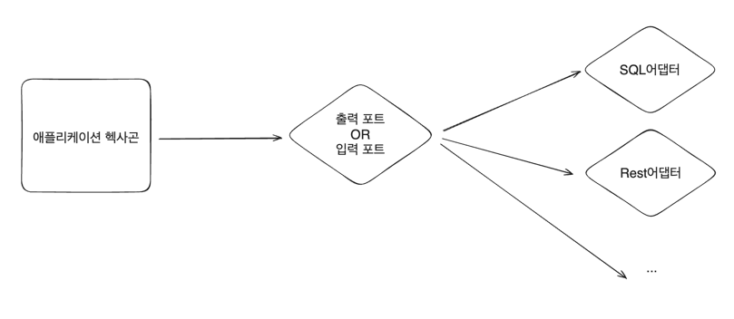

# 3.포트와 유스케이스를 통한 동작 처리

## 유스케이스를 통한 소프트웨어 동작 표현

### 유스케이스 작성 방법
- 액터(Actor): 인프라 엔지니어
- 목표(Goal): 에지 라우터에 새로운 네트워크를 추가
- 범위(Scope): 인프라 부서
- 트리거(Trigger): 다른 네트워크를 통한 네트워크 액세스를 분리하는 특별한 이유
- 입력 데이터(Input data): 라우터 ID, 네트워크 이름, 주소, CIDR
- 액션
  - 라우터 ID를 찾는다.
  - 네트워크 주소가 이미 존재하는지 확인한다.
  - CIDR이 최솟값 아래인지 확인한다.
  - 이전 검사에서 문제가 없다면 통보된 라우터에 네트워크를 추가한다.

자동화 테스트를 작성해본다면 아래와 같을 수 있다.
```text
Scenario: 기존 라우터에 네트워크 추가
  Given: 라우터 ID와 네트워크 세부 사항을 제공한다
  When: 라우터를 발견했다
  And: 네트워크 주소가 유효하며 기존에 존재하지 않는다
  And: CIDR가 유효하다
  Then: 네트워크가 추가된다
```

위의 테스트 단계를 기반으로 유스케이스 단계의 유효성 검사를 자동화하는 테스트 클래스를 작성한다.

```kotlin
    class AddNetworkSteps(
        val routerId: RouterId,
        
        val router: Router
        
        val RouterNetworkFileAdapter: RouterNetworkFileAdapter = RouterNetworkFileAdapter.instance,
        
        val network: Network = Network(
                ip = Ip("20.0.0.0"),
                name = "Marketing",
                cidr = 8
            )
    )
    
    ... 생략 
```

BDD 기반 유스케이스 타입의 시각적인 표현

 
    
유스케이스를 구현하는것 보단 추상적인 개념으로 설계한다.

유스케이스의 작성된 형태를 기반으로 하는 유스케이스 인터페이스
```kotlin
   interface RouterNetworkUseCase {
       fun addNetworkToRouter(routerId: RouterId, network: Network): Router
   }
```

유스케이스를 인터페이스로 정의하는 2가지의 이유
- 유스케이스 목표로 달성하는 다양한 방법 제공
- 구현보다는 추상적 개념에 대한 의존성 허용

헥사고널 아키텍처에서 유스케이스의 역할은 입력 포트 구현을 허용하는 것 <br>
`중요한것은 외부 세계와 통신을 준비 중`이라는 것이다.

기술적인 세부사항보다 문제 영역에 더 중점을 둘 수 있도록 하는 것 




